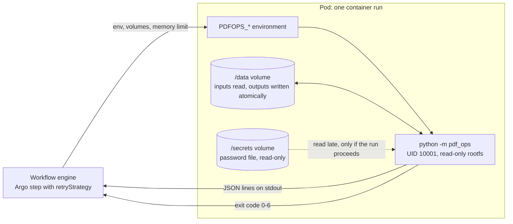
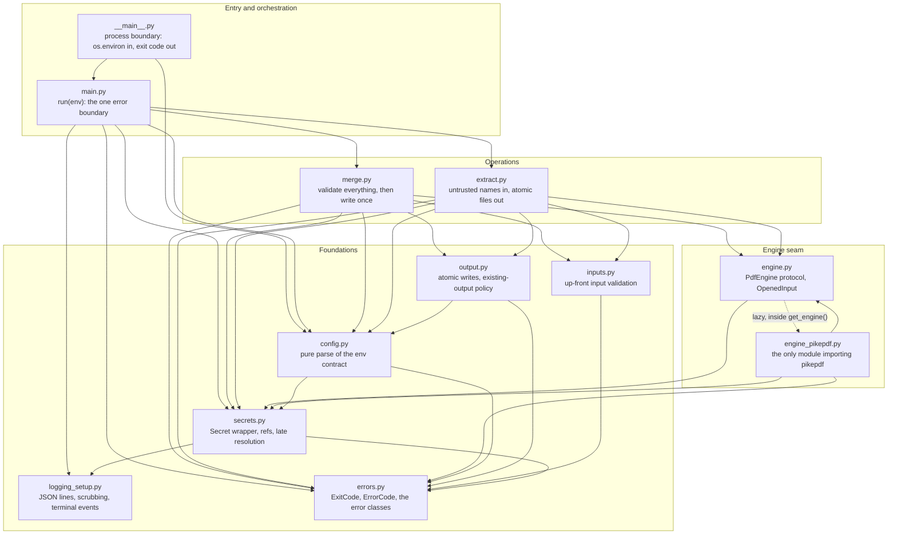
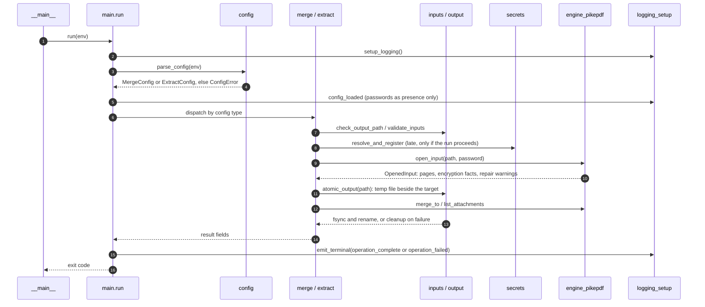
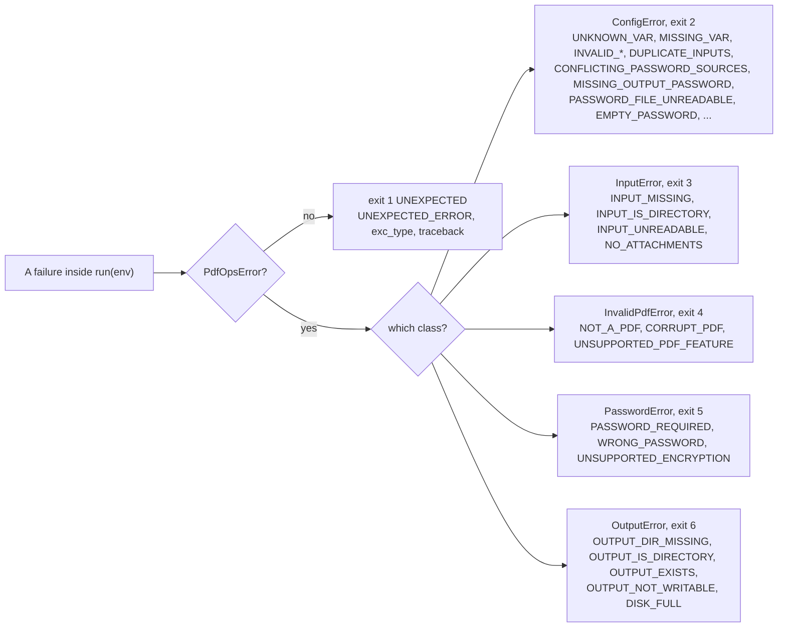
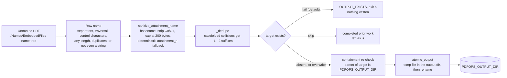
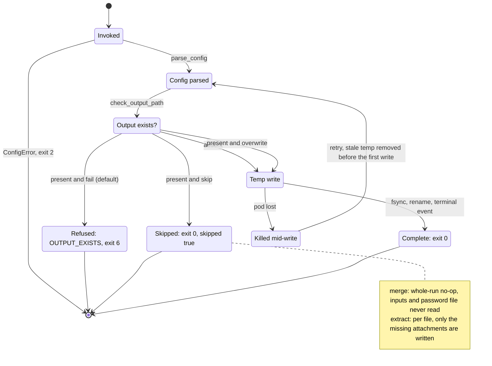
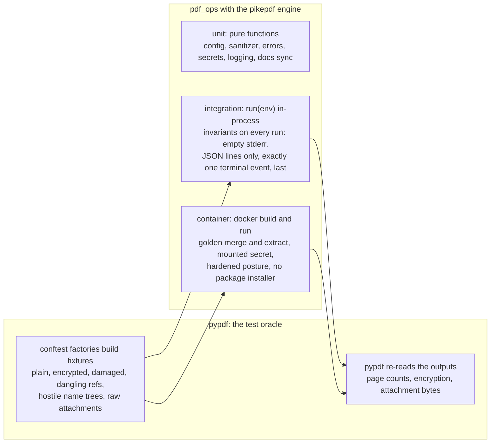
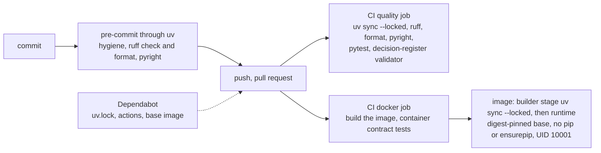

# Architecture in diagrams

Eight views of the same system, drawn so they render on GitHub, in pull requests
and in most editors. Each says why the shape is what it is and links into the
interactive deep-dive at [`diagrams/index.html`](diagrams/index.html), where nodes
link to the source lines they describe. Prose lives in [`DESIGN.md`](DESIGN.md), the
operator contract in [`OPERATIONS.md`](OPERATIONS.md), and every choice in the
decision register [`DECISIONS.md`](DECISIONS.md).

A test (`tests/unit/test_docs.py`) checks that every module under `src/pdf_ops` is
named on this page, so the module view cannot drift from the tree.

## 1. Where it runs

One container run is one workflow step. Everything the process needs arrives as
environment variables and mounted volumes; everything it reports leaves as JSON
lines on stdout and an exit code. The password file is read late and only when the
run actually proceeds, which is why a retry after a lost-but-successful pod works
even when the secret mount is already gone.

Deep-dive: the deployment posture this is tested under is
[`../deploy/argo-example.yaml`](../deploy/argo-example.yaml).

## 2. Modules and the direction of dependency

Every arrow is a real `import`; nothing points upward. `errors.py` and
`logging_setup.py` import nothing from the package, so anything may use them.
`engine_pikepdf.py` is the only module that imports pikepdf, reached through
`engine.py`'s `get_engine()` with a lazy import, so the seam knows its
implementation while the rest of the package never does.

Deep-dive: [`diagrams/index.html#architecture`](diagrams/index.html#architecture).

## 3. One run, end to end

`run(env)` is the only place that catches exceptions and the only place that emits a
terminal event. Configuration is parsed completely before any file is touched;
secrets resolve only after the existing-output policy has decided the run proceeds;
output goes to a temp file in the destination directory and is renamed in one step.

## 4. Failures: classes, codes, exit codes

The exit code is the external API and stays small. Each error class maps to exactly
one code; the finer `error_code` travels in the terminal event. Anything that is not
a `PdfOpsError` is a bug and exits 1, the only class an engine should retry. The
complete code table is in [`OPERATIONS.md#error-codes`](OPERATIONS.md#error-codes).

## 5. Extract: the boundary an attachment name crosses

An attachment name is attacker-controlled text that ends up as a filename on a
mounted volume. Every name passes through a pure, table-tested sanitizer, then a
casefolded collision check (the volume may be case-insensitive), then the
existing-output policy, then a containment re-check that backs the sanitizer up,
and only then an atomic write.

Deep-dive: [`diagrams/index.html#extract`](diagrams/index.html#extract).

## 6. Retries: the existing-output policy as a state machine

Workflow engines retry at least once, and a pod can vanish after its work
succeeded. `PDFOPS_ON_EXISTS` decides what the next attempt does with an output
that already exists; stale temp debris from a killed write is removed before the
first write of the next attempt.

Deep-dive: [`diagrams/index.html#lifecycle`](diagrams/index.html#lifecycle).

## 7. Tests and the cross-library oracle

pypdf is a dev-only dependency with one job: it builds every fixture and re-reads
every output, so each test is a check between two independent PDF libraries.
Fixtures are generated, never checked in. Three tiers run at three costs.

## 8. From commit to image

One toolchain, one version of each tool, pinned in `uv.lock`: the hooks, CI and a
developer's shell all run ruff and pyright through uv. The image is built from the
same lockfile and ships nothing that could change it.

